# MD5 Collision Attack
* in this lab we will try to exploit the broken algorithm MD5 by generating two different files with the same Hash values.

## Installations
* Install [Hash Clash](https://github.com/cr-marcstevens/hashclash) 
* read the readme there to be able to understand how it works.

## Task1: Generating Two Different Files with the Same MD5 Hash
* first you need to build the hash clash using 
    > ./build.sh
* then you need to build all the functions there using
    > ./ make
* then you will find all the tools in the **bin folder**
* Now to generate two different files with the same MD5 hash value, you need to run this command:
    >  ./bin/md5_fastcoll -p prefix.txt -o msg1.bin msg2.bin
* this **prefix.txt** is normal file which can contiains any dummy data like "Hello I am Abdelaziz Neamatallah"
* then to check that the two generated files are different we can use the **diff tool**
    > diff msg1.bin msg2.bin
* you should see the following: 
    * 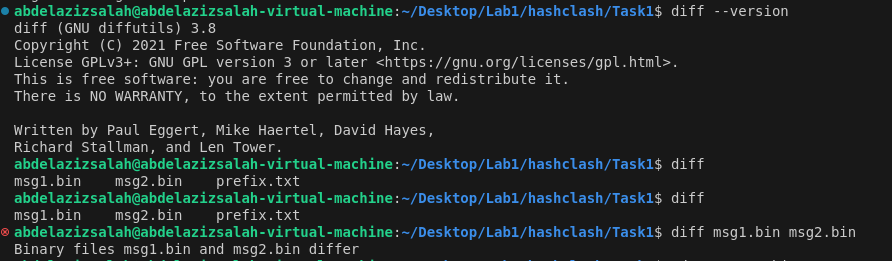
* then to ensure that both have the same md5 value, use the **md5sum**
    > md5sum msg1.bin

    > md5sum msg2.bin
* you should see that both have the exact same output:
    * 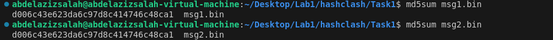
* opening both files we can see that they have the same prefix:
    * 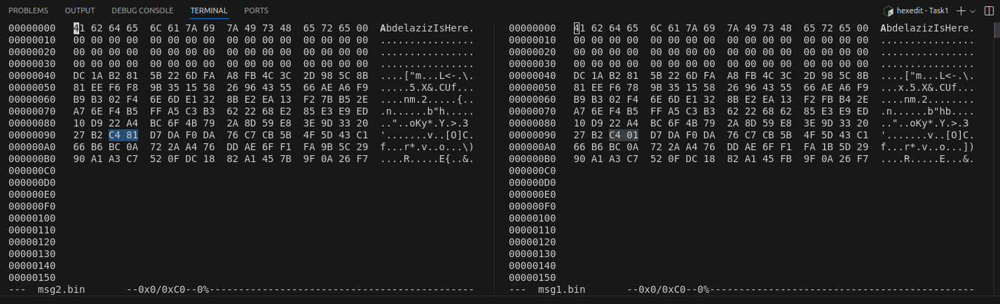
    
* now we have 4 questions to answer:
### Q1. what does this md5_fastcoll does and how it does it?
* Generates two different 128-byte messages with the same MD5 hash.
* To know how it does it, read the src code exists in  **src/md5fastcoll/main.cpp**
### Q2. What happens if the byte length of your prefix file is not a multiple of 64?
* First question to ask here, is how can we determine the byte length of our prefix file
* the answer for this can be done using this command:
    > stat -c %s prefix.txt
* or easily we know that each character is represented as one byte, so we can just count the number of characters inside it.
* for "AbdelazizIsHere" I have 15 characters there, which means 15 bytes, we can ensure this using our tool to get this result: 
    * 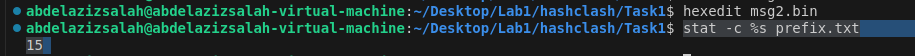
* now to make it easier for us during doing our experiment, lets create a python script, which generate random characters based on the number we give and store it in a file called **prefix2.txt**
``` python
import random
import string

def generate_random_file(length):
    chars = string.ascii_letters + string.digits + string.punctuation
    random_text = ''.join(random.choices(chars, k=length))
    
    with open("prefix2.txt", "w") as f:
        f.write(random_text)

if __name__ == "__main__":
    n = int(input("Enter number of characters to generate: "))
    generate_random_file(n)
    print(f"Generated {n} random characters in prefix2.txt")
```
* then lets generate a file contains 64 bytes and ensure the size using our magic command: 
    * 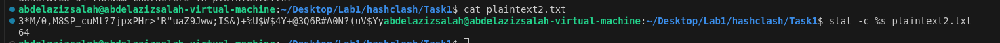
* now lets see what is the difference between what happened when the size was 15, and when it was 64.
    1. case of 64 bytes
        * 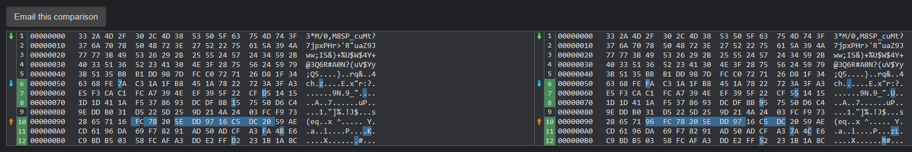
    2. case of 15 bytes
        * 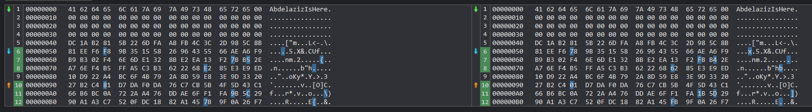
* So first observation is that when the size is less than 64 it just appended zeros after it till the size becomes 16 * 4 = 64 bytes, lets try to make a file with maybe 70 bytes and see what will happen
    3. case of 70 bytes
        * 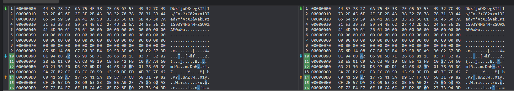
* again it appeded zeros till the size is 16 * 8 = 128 bytes
* so if the size is not multiple of 64, they append zeros till the size becomes a multiple of 64
### Q3. Create a prefix file that has exactly a length of 64 bytes and run the collision generation described above once more. Describe what happens.
* 
* I do not see something special rather than it just does not pad zeros.
* and there are some small differences between two files.
### Q4.  Is the data (128 bytes) generated by md5_fastcoll completely different for both output files? Please identify all the bytes that are different
* 
* from this output it is clearly that they are not completly different, they are almost the same
> Done


## Task2: Understanding MD5’s Property
* 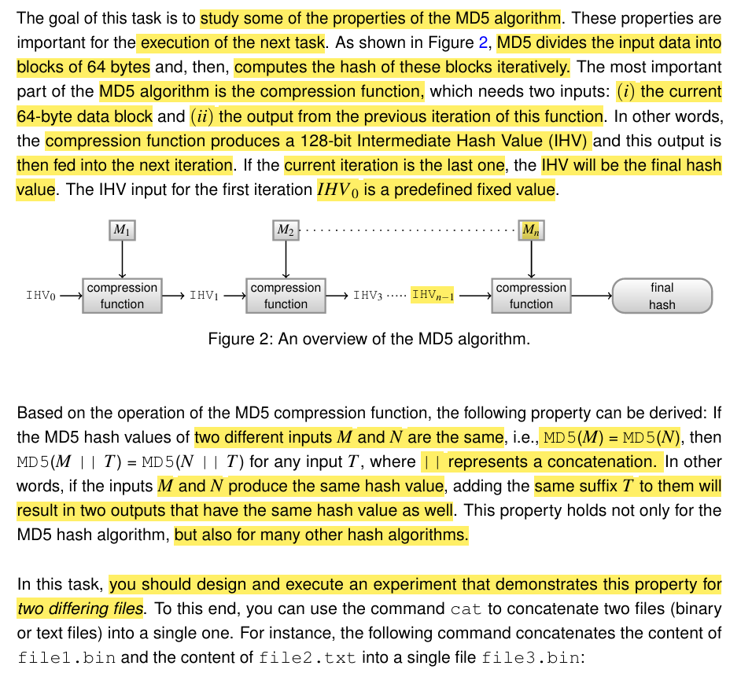
* So, first of all, lets generate two different files with the same hash using md5_fastcoll again
    > cd ../ 

    > mkdir Task2

    > cd Task2

    > cp ../Task1/prefix.txt ./prefix.txt

    > ../bin/md5_fastcoll -p prefix.txt -o file1.bin file2.bin
* 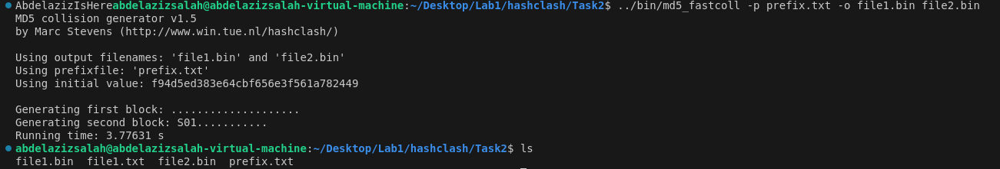
* now lets concatenate another file content to both of them, and see the hash value of them
    * 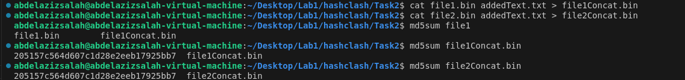
* Now it is clear that both have the same hash even when we added new concatenated data. 
> Done 

## Task 3: Generating Two Files with the Same MD5 Hash
* 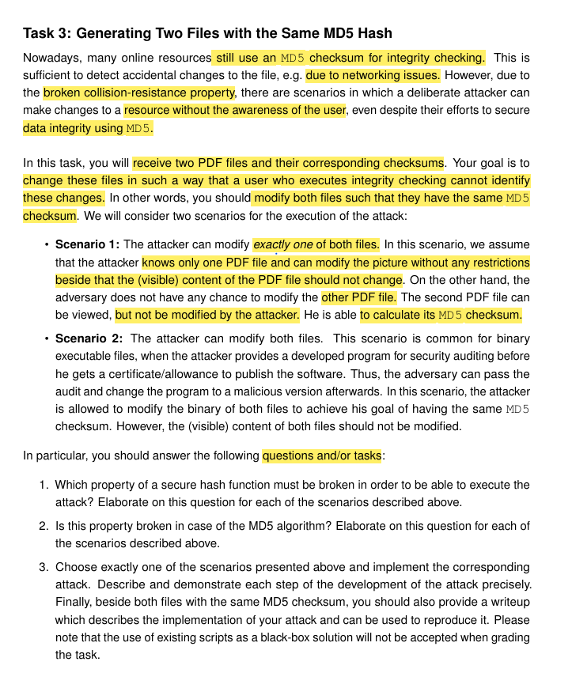
* Scenario 1 Plan: 
    * It was mentioned that it is not possible to generate the exact same hash from different file, so this scenario is not doable (in this time constrained frame - 2 weeks is not enough to think about new way :)
* Scenario 2 Plan: 


* Steps for Scenario 2: 
1. We have 2 pdfs, with two different hash values.
    2. pdf1 -> h1.
    3. pdf2 -> h2.
2. we need to modify both files to get
    - h1 = h2. 
3. Our base logic is that if H(M) = H(N) then  H(M||T) = H(N || T)

### Utility Things to understand
#### 1. Understanding of PDF Structure
* 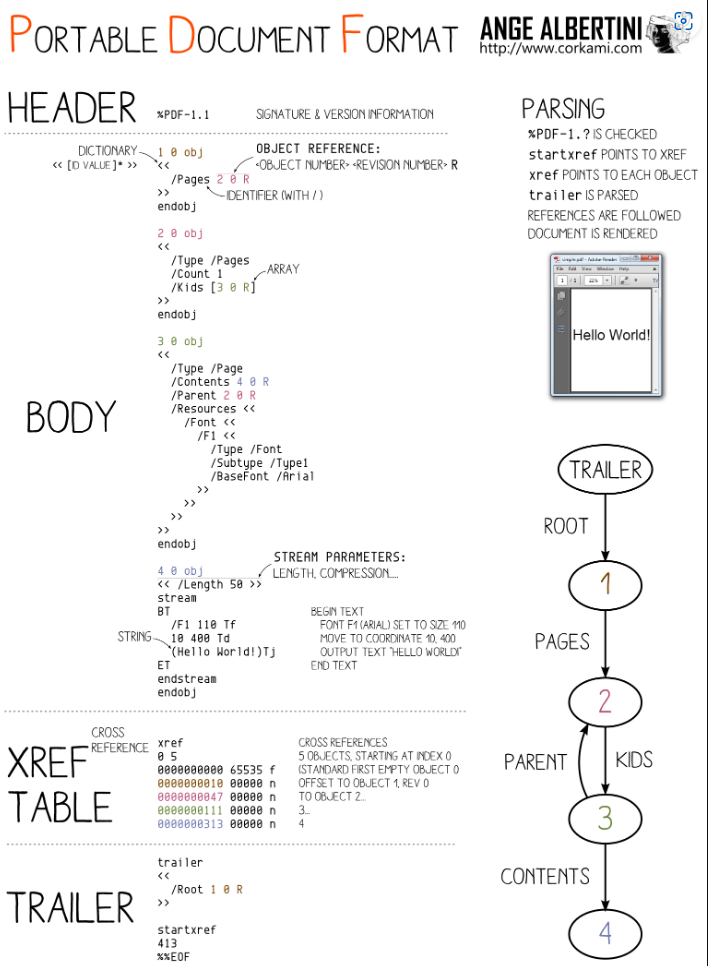
* 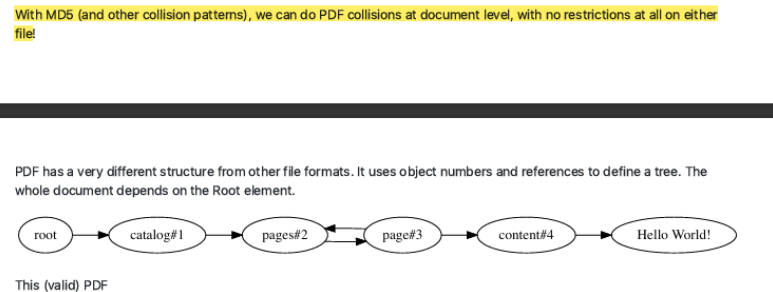
    - Root: it is the cornerstone entry, and it connects everything together
    - Catalog: Points to all pages
    - Pages: Set of different pages
    - Page: single page
    - Content: Content of ech page
* knowing this structure we can do the following 2 tricks.
* 
* this way we can generate same MD5 hash value to any pair of PDFS.

#### 2. Unicoll: 
* Unicoll is a tool for generating chosen-prefix collisions for MD5
* it was developed by Marc Stevens, who also built **HashClash**
##### what is the difference between UniColl and md5_fastcoll?
* md5_fastcoll: Generates an MD5 collision where you have the same prefix (i.e., both messages start the same).
* UniColl: Much more powerful — allows you to generate a collision where the two files can have different prefixes that you choose yourself **-> and this is exactly what we want in our case**

##### Internals of UniColl (basic idea)
1. we pick two prefixes, P1 and P2
2. UniColl extends these prefixes carefully (adding special padding blocks)
3. It uses differential cryptanalysis on MD5's compression function

##### UniColl in more details:
1. based on this pdf [trickToGetInstantCollision](https://www.exploit-db.com/docs/english/46047-md5-collision-of-these-2-images-is-now()-trivial-and-instant.pdf)  from exploitation database
2. 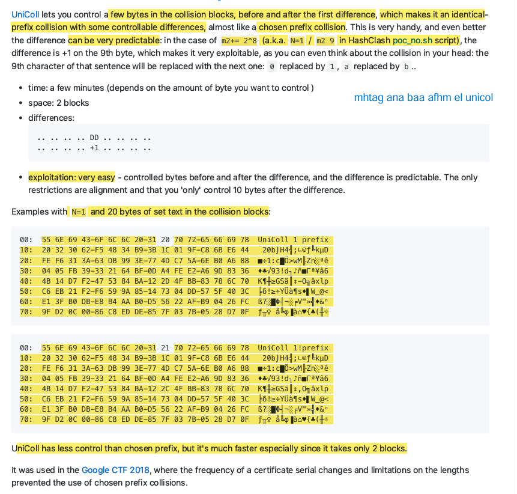
3. it was mentioned that we can control a few bytes in the collision blocks, and in our case of pdf, we just need to modify the pointer which points to which tree to be shown, and everything else will be exactly the same.
4. so if we could do this we will have the following:
    1. Merged file1 -> X = A + B
    2. copy of Merged file1 -> Y = X = A + B
    3. the header of file X should show the content of A only
    4. the header of file Y should show  the content of B only
    5. using the UniColl trick, we know that this will be single byte to change
    6. thus we will get H(X) = H(Y) at the end with the visible content not change for any of both files.

##### Explaining the process overview
* 

##### Lets see commands to exploit this idea
1. so we need to write a python code to do all of this, you can find it in **myOwnScript.py**
2. we need to generate two different headers which has the exact same hash value, this can be done using **cpc script** 
    > cat **The header of pdf1** > pdf1.bin
    
    > cat **The header of pdf2** > pdf2.bin
    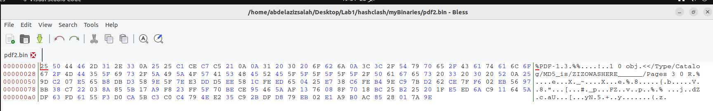
    > cpc.sh pdf1.bin pdf2.bin
    
    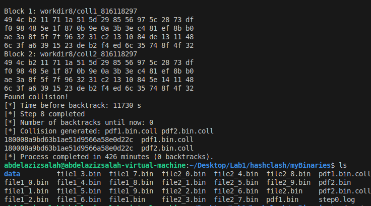

    > Take the generated bins and move them to the directory which contains your python script, rename them **pdf1.bin** **pdf2.bin** and runs it
3. then run the script
    > python myOwnScript.py file1.pdf file2.pdf
4. then you should see two generated pdfs called:
    1. ZizoAttackedFile1.pdf
    2. ZizoAttackedFile2.pdf
5. 
6. 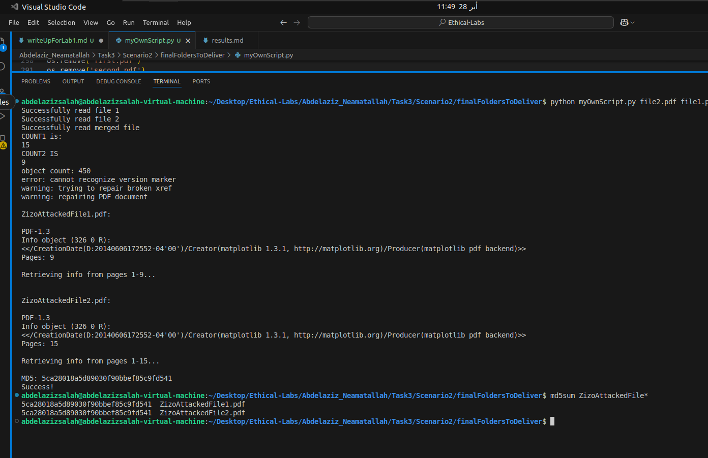


## Answering the Task3 Questions:
1. which property of a secure hash function must be broken -> **collision resistance for scenario 2, and targeted collision resistace for scenario 1**
2. Is this property broken in case of the MD5 algorithm? Elaborate on this question for each of the scenarios described above.
    - for Scenario 2: The collision resistance property of the MD5 algorithm is considered to be broken. This means that it is possible to find two different inputs that produce the same MD5 hash output, which is known as a collision.
    - for Scenario 1: no it is not broken
3. Elaborate on limitations and possibilities of executing such an attack for each of the scenarios.
    - for Scenario 1: The limitations are that the attacker cannot change the visible content of the first PDF file, which means that the attack is limited to changing the hidden data in the file. Also, the attacker can only modify one PDF file, which limits the attack further. Another limitation is that the attacker must find a collision in the MD5 function which produces the same hash for both PDFs.

    - for Scenario 2: The limitations of this attack are similar to Scenario 1. The attacker cannot change the visible content of the PDF files, which means that the attack is limited to changing the hidden data in the files. Additionally, the attacker must find a collision in the MD5 hash function that produces the same hash output for both PDF files.

