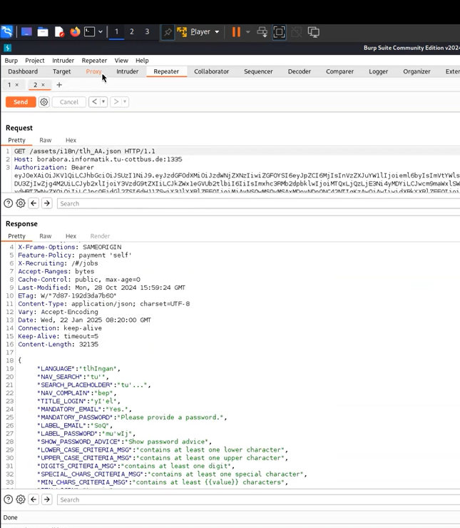

* open burpsuite to intercept the requests. 
* when you change the language and check for the Get request, you can see /de_DE.json for deutsch language
* so this means that this is the name of the file which contains the translation.
* so our target now is to find a file which contains a language which does not exist in the website.
* in your browser go to **OWASP Juice Shop Language Support**
* open the first url
* look for the languages 
* you will find a language which is called **Klingon**
* check for its abreviation **tlh_AA**

## why it works
* because this language is supported by the system, but it was not shown

## how to prevent it
* just remove it from the system, or restrict access