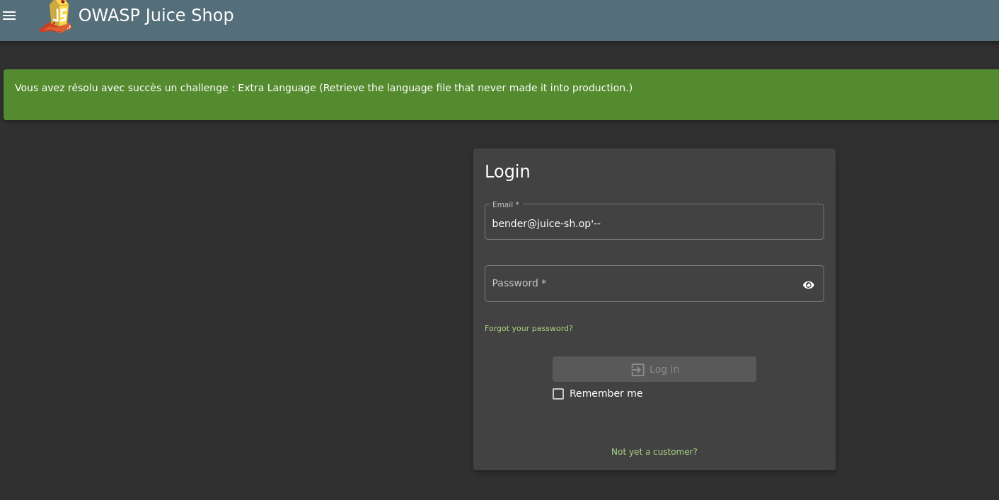
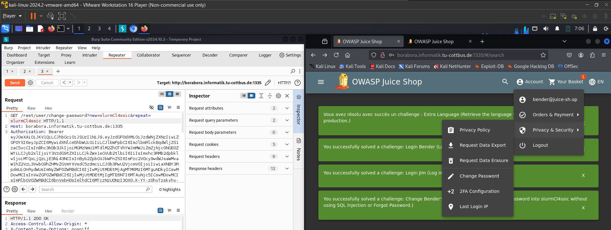
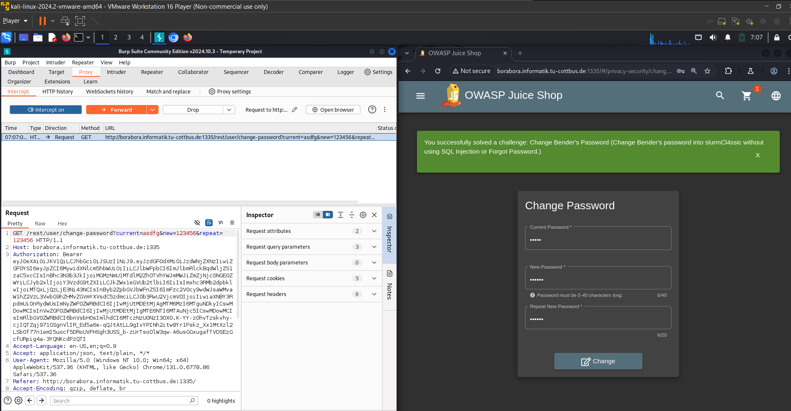
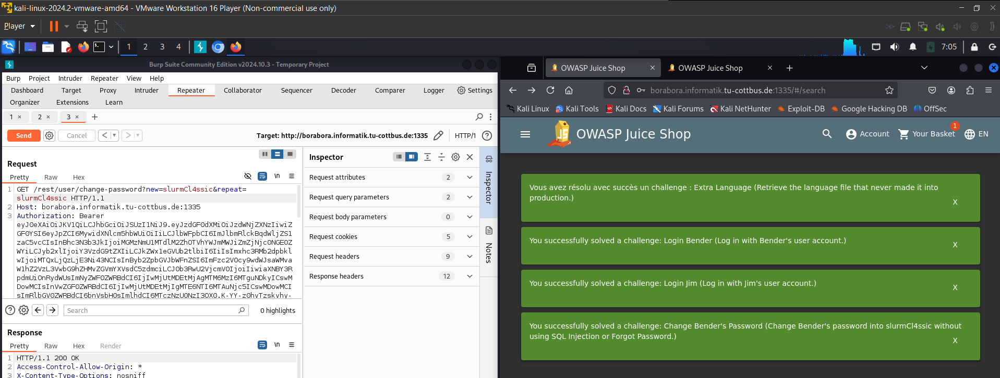

* first we need to get benders email from the administration panel
  * 
* then we can use benders email to log in
  * 
* now we should go to change password
  * 
* then we should open **BurpSuite** to see what is sent in the request when we fill the data
  * 
* then we can send it to the repeater and check what can we do
* then we can try to remove the current password parameter, and set the new password to as wanted in the task, and the task will be solved. 
  * 

## again the problem with front-end validation.