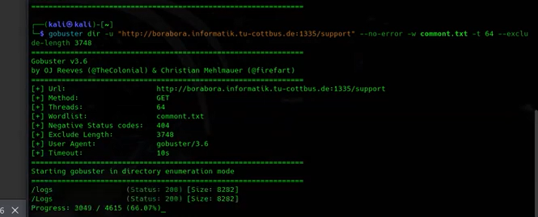

* we need to enumerate the server using **ffuf** or **gobuster**
* gobuster dir -u **'our url string'** -w **'wordlist path'** --no-error -t 64 --exclude-length 3748
* we exclude this length because the server always sends 200, which let us not distinguishes between valid inputs, so we will try to list only files with differnt sizes.
* you will find a folder called **ftp**.
* navigate to it using the url
* then navigate to **support/logs**

## why it works
* because these folders are on the server and by enumerating them, we can find hidden folders, and try to access it.

## how to prevent it
* restric the access to this folder
* remove this folder.