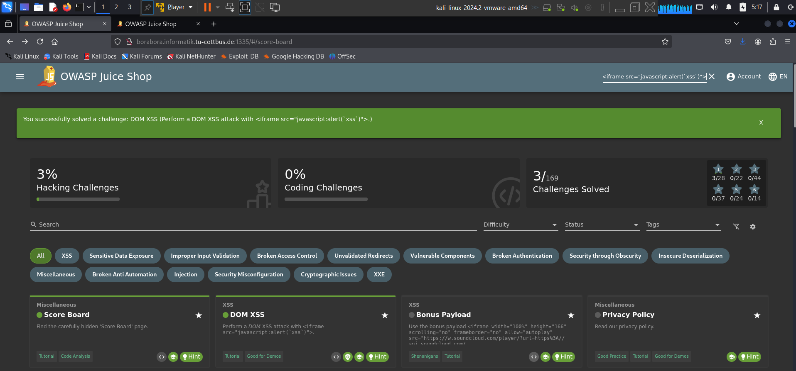
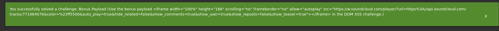

* in the search bar, there is no proper input validation
* so when we try to excute **h1> input /h1>** it is excuted as html
* so if we excuted **<iframe src="javascript:alert(`xss`)"** it will be excuted as a command, and will solve the task. 
* also I solved the bonus part using the same concept. 
* 
## How to prevent the vulnerability
* To prevent DOM-based XSS, the application should:

   1.  Sanitize user input using libraries like DOMPurify.
   2. Avoid dangerous functions like innerHTML, eval(), or document.write() for handling untrusted data.
    3. Use safer alternatives like textContent instead of innerHTML.

## why it works: 
* because the application includes the user input directly inside the DOM without senitizing, so it acts as part of the code, and excutes the functionalilty. 