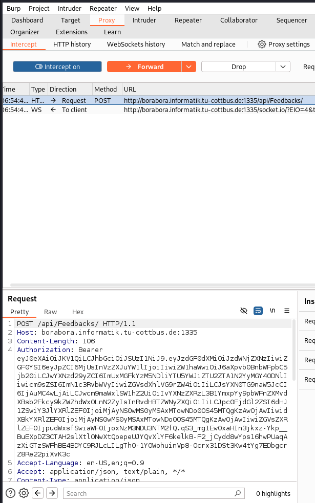

* I managed to solve this by using **burpSuite tool**
* the task was to give 0 as rating
* so using the burpsuit tool, I can intercept the post request as follows:
  1. open burpsuit proxy tab
  2. press intercept button off to make it **on**
  3. then fill all the data properly in the first case as follows:
     - 
  4. now press submit
  5. look at burpsuit, you will find the sent request
     - 
  6. modify the rating and make it 0
     - 
   7. now press forward
   8. and press intercept off
   9. you will find that you sent the feedback and managed to solve it.
    - 

## Why it works
* because the check is only from the front-end side
* so we can manipulate it using BurpSuite

## how to prevent
* use validations in backend. 