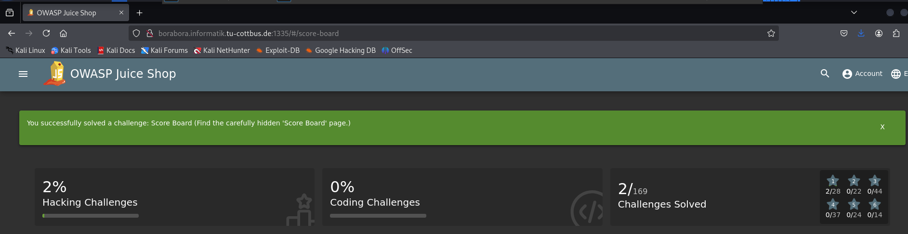
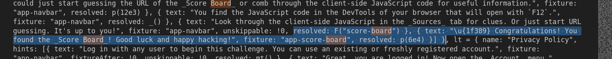

* To find it, I opened the source code using **F12**
* Then I looked for the script files exists.
* then I tried to open all the .js files existing and search for a **board** word or **score**
* when I downloaded the whole page, all the files exists in a folder called **OWASPJUiceShopHomePage_files**
* then I found this in the **main.js**
  
* so I navigated to **http://borabora.informatik.tu-cottbus.de:1335/score-board**
* but this was not the correct link
* so I tried **http://borabora.informatik.tu-cottbus.de:1335/#/score-board** and I successfully found the link I want to access.