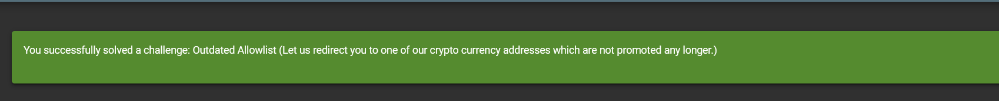
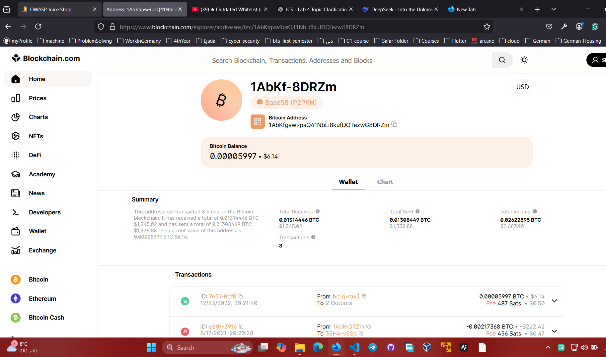

* usually the redirects exists in the .js files.
* so I opened the console
* looked for js files.
* inside them I searched for **redirect** keyword
* and I found this redirect
  * redirect?to=https://blockchain.info/address/1AbKfgvw9psQ41NbLi8kufDQTezwG8DRZm
* I added it in the url
* and it opened this page for me:
  *  

## why it works
* because the developers forgot to remove it from the js files.

## how to prevent
* remove it :).