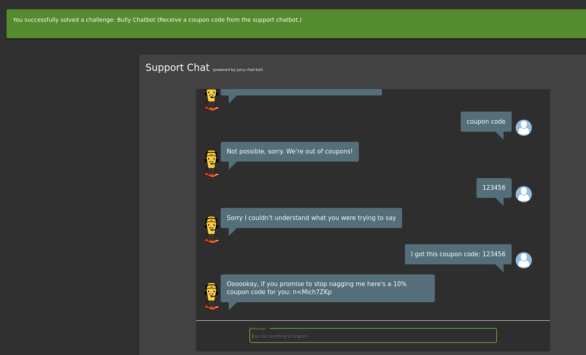

* I have just kept sending messages to the support chatbot asking for coupon
* and then I told him that I have certain coupon, and he responed with one coupon
* I think the idea is to keep asking for coupon until it gives you one.

## Why it works:
- Exploits Chatbot Logic:

   * Many chatbots rely on predefined rules or AI models that respond to repetitive queries without detection mechanisms.
    * Some bots may lack request limits, allowing users to abuse their responses.

- Automated Response Loops:

   - If the chatbot doesn't track past interactions, it may keep generating responses indefinitely.
    - Some chatbots issue discount codes automatically, allowing attackers to extract multiple codes.

## How to prevent it
- Rate Limiting & Request Throttling like using CAPTCHA
- Session Awareness in Chatbots by tracking and blocking such spaming.
