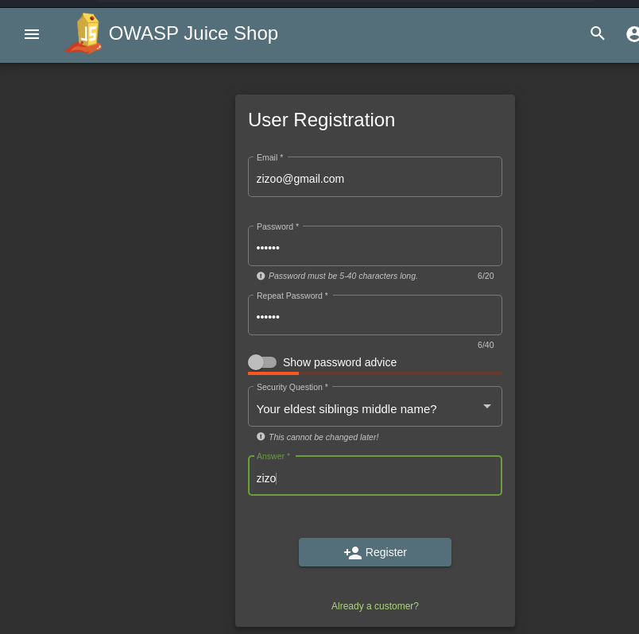

* I managed to solve this by using **burpSuite tool**
* the task was to exploit improper input validation at the server, which is the server does not check if the password is the same as the repeat password, and the validation is done only on the client side.
* so using the burpsuit tool, I can intercept the post request as follows:
  1. open burpsuit proxy tab
  2. press intercept button off to make it **on**
  3. then fill all the data properly in the first case as follows:
     - 
  4. now press register
  5. look at burpsuit, you will find the sent request
     - 
  6. modify the passwordRepeat and make it empty
     - 
   7. now press forward
   8. and press intercept off
   9. you will find that it redirected you to the login screen
   10. insert your credientials
   11. you will find that you are logged in successfully
        - 
        - 
  
## Why It Works?

- Frontend Validation vs. Backend Validation Mismatch:
   *     The initial check for password matching happens client-side (JavaScript).
    *    If the second validation step is not enforced server-side, an inconsistent password can be submitted.

- Flawed Input Handling in Registration Logic:
  *   The form initially blocks mismatched passwords.
        However, once a valid match is set, the final submission may only validate the first password field, ignoring changes to the second field.

- Potential Exploits:
   *   Users may accidentally register with an incorrect password, leading to login failures.
        Attackers could manipulate this flaw to bypass validation checks, potentially testing weak passwords or manipulating accounts.

## How to prevent
* apply backend validation.