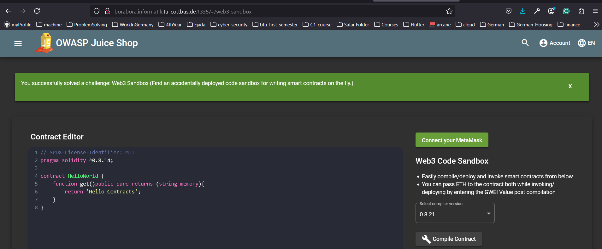

* The task was to find a web3-sandbox which is an interactive enviroment where we can test applications using the web3 technologies. It provides a controlled and often simulated environment for working with blockchain protocols, smart contracts, and decentralized networks.
* so it was just hidden in the website.
* so I tried to brute-force the url with things like 
  * /sandbox
  * /sand-box
  * /web3
  * /web3-sandbox -> the correct path.
  

## Why it works
* because it exists on the server, it is not available on UI, but it can be accessed via navigation
* and developers may have forgot it.

## prevention
* remove it
* restric access to it. 