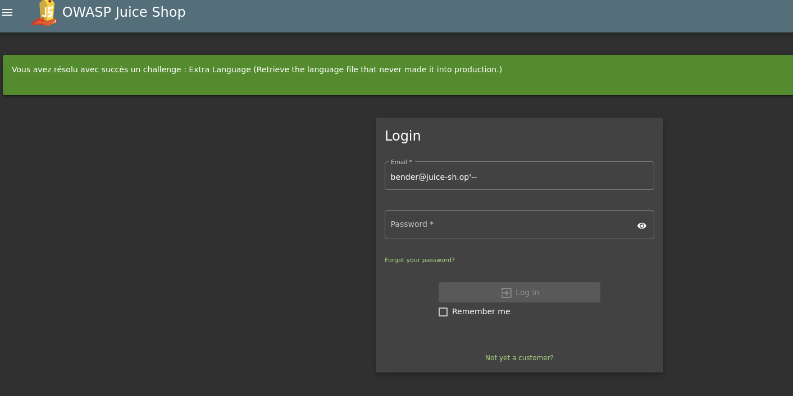
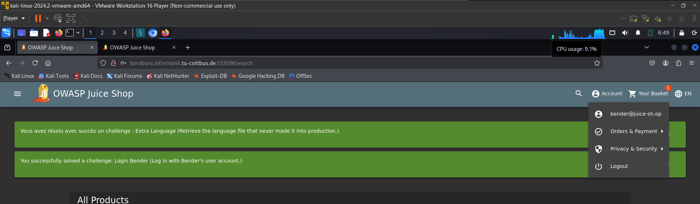
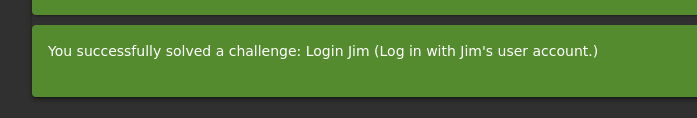

* first we need to get benders email from the administration panel
  * 
* then we can use benders email to log in
  * 
* then we solved the task
  * 
* same to Jim 
  * 

## why it works
* because the system insert the user input directly to SQL query, and when the attacker uses -- it comments all any string after it

## how to prevent
* use synthaziing.