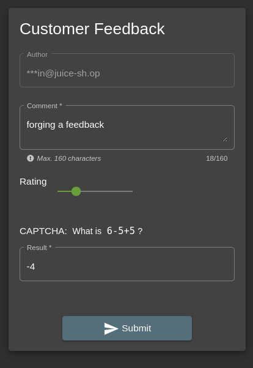
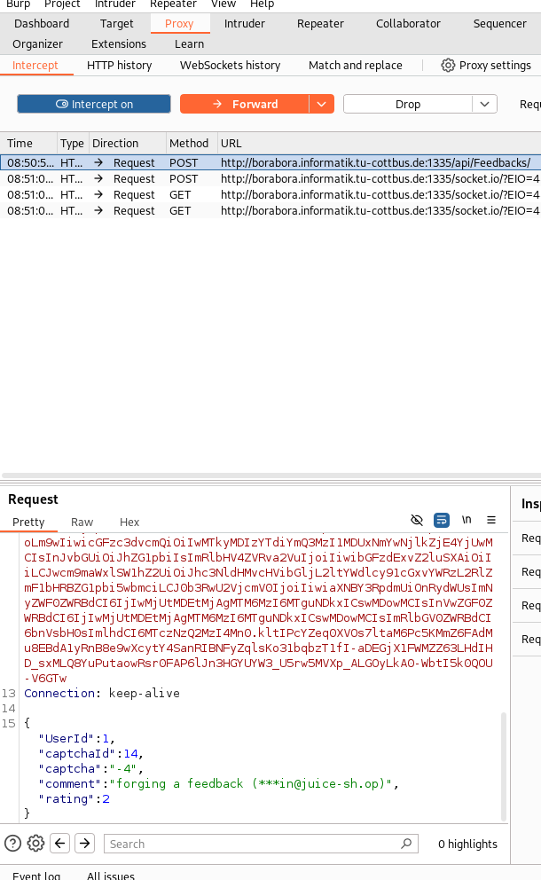
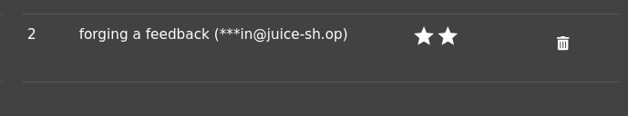

* I managed to solve this by using **burpSuite tool**
* the task was to give a feedback, but with another user name
* so using the burpsuit tool, I can intercept the post request as follows:
  1. open burpsuit proxy tab
  2. press intercept button off to make it **on**
  3. then fill all the data properly in the first case as follows:
     - 
  4. now press submit
  5. look at burpsuit, you will find the sent request
     - 
  6. modify the userId and make it 2
     - 
   7. now press forward
   8. and press intercept off
   9. we can check if it went correct at the admin panel 
   10. 

## why it works
* because the server trusts the user sent data, without using authentication tokens.

## how to prevent
* use better authorization methods.