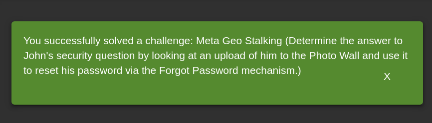
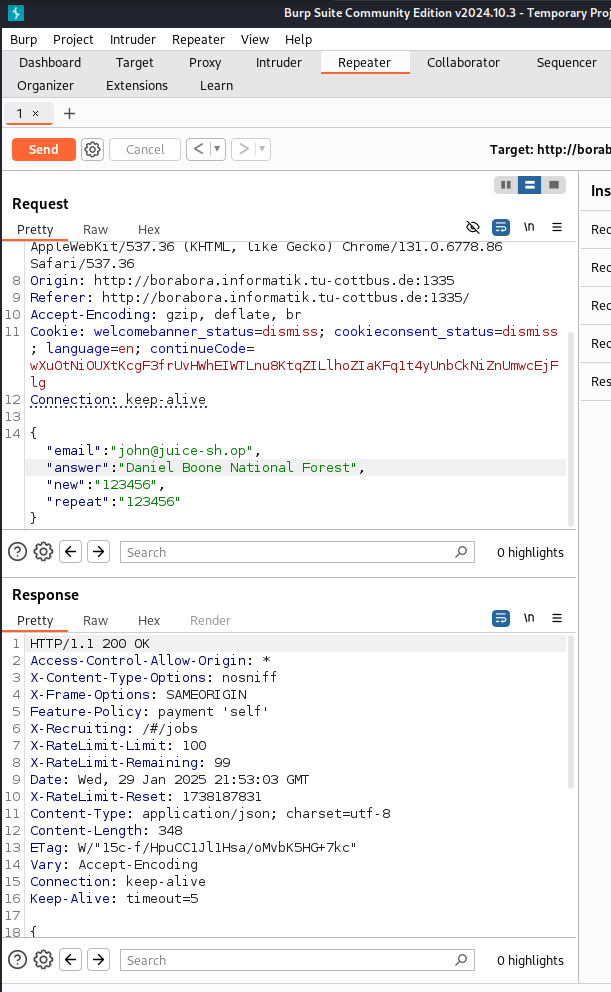
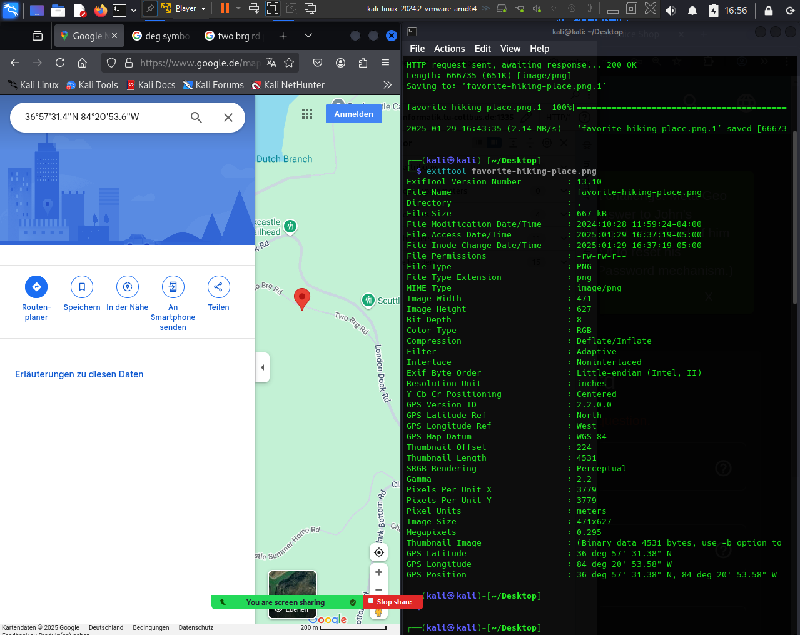

* First of all we need to open the photo wall and search for the image which john has uploaded.
* then we need to find his email by logining into the admin account, then go to the administration endpoint, and get his email.
* then we go to the login page, and do forget password, and write john's email.
* then we will find the question is:
  * what is your fav place for hiking?
* so we can try to guess words like: forests?
* but it will not be correct, so we will need to get details about photos, so we will use tool **exiftool** which can show some properties about photos.
  1. download the photo using **wget http://borabora.informatik.tu-cottbus.de:1335/assets/public/images/uploads/favorite-hiking-place.png**
  2. excute  **exiftool favorite-hiking-place.png**
  3. then google the GPS Position
  4. 
  5. then we can search for the neighbour locations, until we can find the correct answer
  6. But when we look for the location in Google Maps, it can be seen that this location is in some remote forest area and there are not many places close to the coordinates. So, we can make a list of all the places nearby and then pass the same to OWASP Zap Fuzzer. Some of the locations close to the coordinates are:
        - Laurel County School District
        - Laurel County School
        - Laurel County 
        - Scuttlehole Trailhead
        - Goodin Branch
        - Dutch Branch
        - Rockcastle Campground
        - Daniel Boone National Forest
        - Holly Bay Campground
        - Mt Victory
        - Cumberland River
   7. then we can find the correct answer as Daniel Boone National Forest