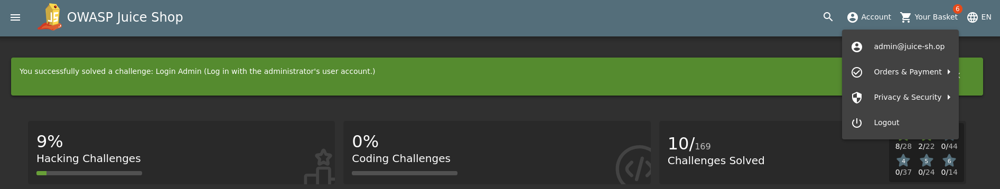
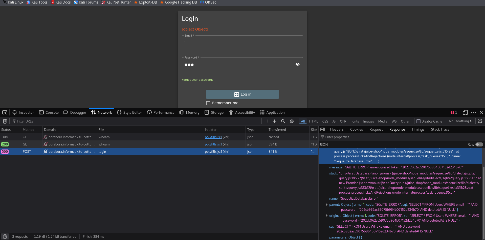
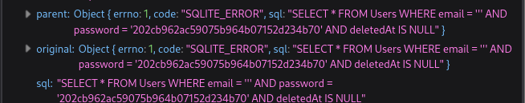

* the task was to log in as admin
1. open the login page
2. then in the email field add **'** and open the network in the console to check what was sent.
   
3. then now you can see that there is a SQLite Error which indicates many things
   1. the used DBMS is SQLite
   2. the sent query is 
4. so if we can bypass this condition we can have access to the system.
5. so I inserted **or true--** to bypass the Anding condition
6. and the -- to comment the password condition
7. so the excuted query will be 
   1. Select * from Users Where (email=''or true) **-- password (which is commented part)**
   2. so the query will be executed and the admin will be logged in
> this worked because the first user in the data base was the admin, and this will be the way always how can we access any user account. 

## Why it works
* because the application directly inserts user input into an SQL query without sanitization

## how to prevent
* implement input validation
* use web application firewalls.