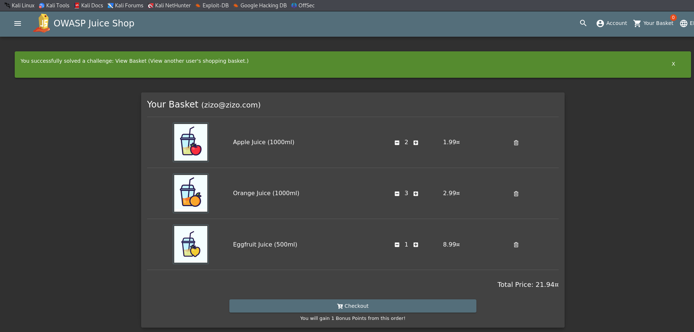

* Log in to the admin and open his basket.
* then open another tab
* logout
* log in with zizo account
* refresh the first tab in which you opened the admin
* you will still see the admin content instead of zizo
* due to the presence of the cookies of the admin in this tab.

## Why it works
* because the cookies sent is of the previous user, so it will send all the data regarding these cookies
  
## how to prevent
* ask for the token with the cookies, to ensure that you are sending the correct data to the correct user. 