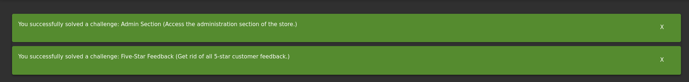
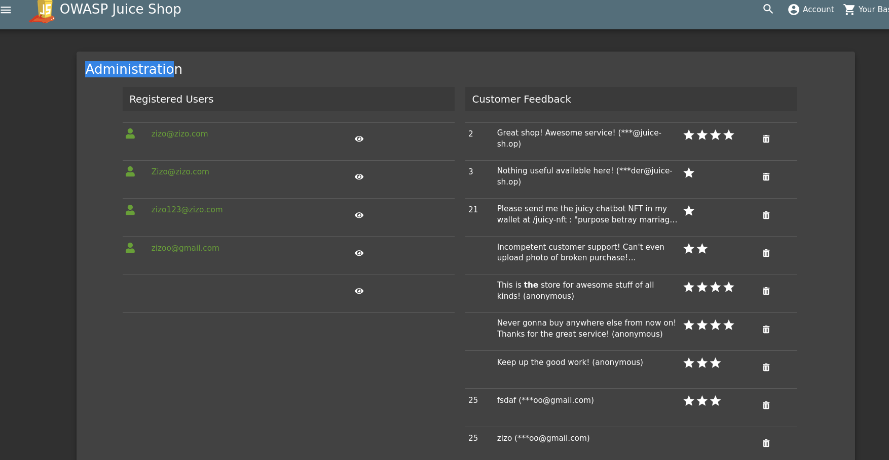

* first of all we must know that any website, usually have admin page or section
* and this page usually have the path name
  * admin
  * admin-path
  * admin-dashboard.
  * administiration
* so I tried them, and I found it at administiration endpoint
* then I found only one 5 stars review, and I deleted it 
* 
> we must log in with the admin account first. 

## why it works
* any website has administration page
* so If we know its path, we can navigate to it.

## how to prevent
* you can not prevent it, if the attacker gain access to the admin account
* just try to make the admin account secure