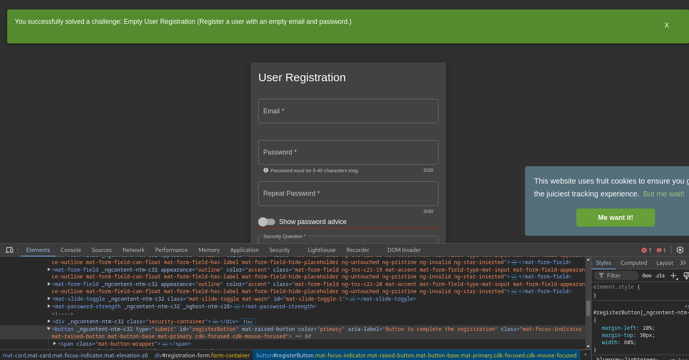

* I used f12 to play with the UI components
* and then I found that the button is disabled because of some conditions.
* I changed the state of the button from the class by removing **mat-button-disabled** from the class, and also remove the **disabled="true"** 
* this allows me to press on the register, and submit the request.

## again only front end validation